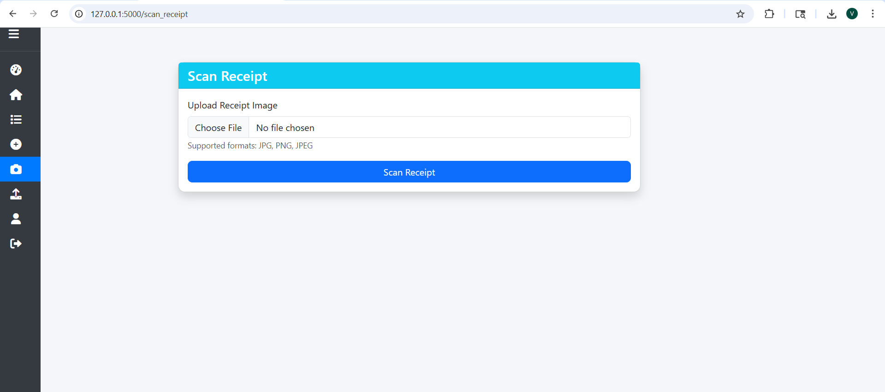

# 💰 Smart Expense Tracker

A secure and intelligent **Flask-based Expense Management System** that combines traditional expense tracking with **Machine Learning**, **Optical Character Recognition (OCR)**, and **predictive analytics** to help users manage and analyze their personal finances efficiently.

Designed as a full-stack project, the application enables users to record expenses, automatically categorize transactions using AI, scan receipts, forecast future spending, generate reports, and monitor budgets through an interactive dashboard.

---

# ✨ Key Features

### 🔐 Secure Authentication

* User Registration & Login
* Password strength validation
* BCrypt password hashing
* Session management using Flask-Login
* Role-based Admin access
* Protected routes

---

### 💸 Expense Management

* Add new expenses
* Edit existing expenses
* Delete expenses
* Bulk delete multiple expenses
* Search expenses
* Category-wise organization
* Date-wise tracking

---

### 🤖 AI-Powered Expense Categorization

Automatically predicts expense categories using a trained Machine Learning model.

**Model**

* TF-IDF Vectorizer
* Logistic Regression Classifier
* Label Encoding
* Text preprocessing pipeline

The model has been trained on **1000+ real-world bank transactions** to classify expenses into common financial categories.

---

### 📸 Smart Receipt Scanner (OCR)

Upload an image of a receipt to automatically extract transaction details.

Technologies used:

* Tesseract OCR
* OpenCV
* Pillow

The application extracts useful information from receipts and simplifies manual expense entry.

---

### 📊 Interactive Dashboard

The dashboard provides a complete overview of personal finances, including:

* Total expenses
* Current month's spending
* Category-wise expense distribution
* Recent transactions
* Spending visualization using charts
* Monthly spending prediction
* Budget alerts

---

### 📈 Spending Prediction

Uses **Linear Regression** to analyze historical expenses and estimate future monthly spending.

The prediction is compared against the user's configured budget to generate intelligent spending alerts.

---

### 📂 Bank Statement Import

Import expenses directly from CSV bank statements.

Features include:

* Automatic transaction parsing
* AI-based category prediction
* Faster bulk expense management

---

### 📄 Report Generation

Generate reports in multiple formats.

Supported exports:

* CSV
* PDF

Useful for maintaining financial records or sharing expense summaries.

---

### 👨‍💼 Admin Dashboard

Administrative interface providing:

* User management
* Expense management
* Global expense analytics
* Search functionality
* Total users
* Total expenses
* Average spending statistics

---

# 🛠 Technology Stack

| Layer            | Technologies                       |
| ---------------- | ---------------------------------- |
| Backend          | Python, Flask                      |
| Database         | SQLite, SQLAlchemy                 |
| Frontend         | HTML5, CSS3, Bootstrap, JavaScript |
| Charts           | Chart.js                           |
| Machine Learning | Scikit-learn                       |
| OCR              | Tesseract OCR, OpenCV, Pillow      |
| Data Processing  | Pandas, NumPy                      |
| Authentication   | Flask-Login, Flask-Bcrypt          |

---

# 📂 Project Structure

```text
smart_expense_tracker/
│
├── app/
│   ├── __init__.py
│   ├── auth.py
│   ├── expenses.py
│   ├── models.py
│   ├── prediction.py
│   ├── ml_model.py
│   ├── expense_model.pkl
│   ├── vectorizer.pkl
│   ├── label_encoder.pkl
│   └── bank_transactions_1000.csv
│
├── templates/
├── static/
├── config.py
├── run.py
├── requirements.txt
├── README.md
└── .gitignore
```

---

# 🚀 Installation

Clone the repository

```bash
git clone https://github.com/<your-username>/AI-Expense-Tracker-.git
```

Navigate into the project

```bash
cd smart-expense-tracker
```

Create a virtual environment

**Windows**

```bash
python -m venv venv
venv\Scripts\activate
```

**Linux / macOS**

```bash
python3 -m venv venv
source venv/bin/activate
```

Install dependencies

```bash
pip install -r requirements.txt
```

Run the application

```bash
python run.py
```

Open your browser

```
http://127.0.0.1:5000
```

---

# 📷 Application Modules

* Authentication
* Dashboard
* Expense Management
* Receipt Scanner
* Bank Statement Import
* Expense Prediction
* Budget Monitoring
* Reports
* Admin Panel
* User Profile

---

# 🤖 Machine Learning Pipeline

1. Transaction description preprocessing
2. Text cleaning
3. TF-IDF feature extraction
4. Logistic Regression classification
5. Category prediction
6. Expense storage

The trained model is stored as:

* `expense_model.pkl`
* `vectorizer.pkl`
* `label_encoder.pkl`

---

# 📈 Forecasting Pipeline

Historical monthly expenses are analyzed using **Linear Regression** to estimate future spending.

The prediction engine powers:

* Spending forecasts
* Budget alerts
* Dashboard insights

---

# 🔒 Security Features

* BCrypt password hashing
* Strong password policy
* Email validation
* Role-based authorization
* Login-required routes
* Session management

---

# 📸 Screenshots

Add screenshots here.

## Screenshots

### Login


### Dashboard


### Receipt Scanner



### 


### Dashboard


### Receipt Scanner


### Profile


# 📋 Requirements

* Python 3.10+
* Flask
* SQLite
* Tesseract OCR
* OpenCV
* Scikit-learn
* Pandas
* NumPy

Install dependencies with:

```bash
pip install -r requirements.txt
```

---

# 📌 Future Improvements

Potential enhancements include:

* Email notifications
* Multi-currency support
* Dark mode
* Cloud database integration (PostgreSQL/MySQL)
* REST API for mobile applications
* Docker deployment
* Two-factor authentication (2FA)
* Interactive analytics with additional chart types

---

# 🤝 Contributing

Contributions are welcome.

1. Fork the repository
2. Create a feature branch
3. Commit your changes
4. Push to your branch
5. Open a Pull Request

---

# 📄 License

This project is licensed under the MIT License.

---

# 👨‍💻 Author

**Vansh**

GitHub: https://github.com/vansh3452

---

⭐ If you found this project useful, consider giving it a star on GitHub.
